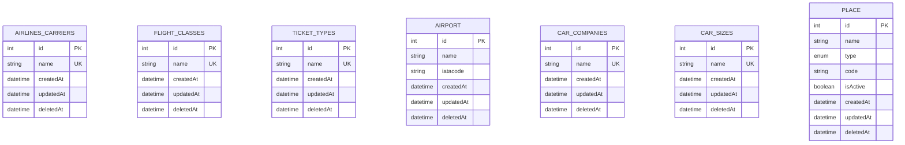

# 📦 BCD Japan Lookup Service — Entities Documentation

> Complete reference for all database entities, enums, and in-memory data structures used across the service.

---

## Table of Contents

- [Overview](#overview)
- [Entity Relationship Diagram](#entity-relationship-diagram)
- [Common Patterns](#common-patterns)
- [Airlines Module](#airlines-module)
  - [AirlinesCarrier](#airlinescarrier)
  - [FlightClass](#flightclass)
  - [TicketType](#tickettype)
- [Airports Module](#airports-module)
  - [Airport](#airport)
- [Cars Module](#cars-module)
  - [CarCompany](#carcompany)
  - [CarSize](#carsize)
- [Places Module](#places-module)
  - [Place](#place)
  - [PlaceType Enum](#placetype-enum)
- [Hotels Module (Enum-based)](#hotels-module-enum-based)
  - [MealPlanEnum](#mealplanenum)
  - [NumberOfRoomsEnum](#numberofroomsenum)
  - [SmokingConditionEnum](#smokingconditionenum)
  - [Bed Types (In-memory)](#bed-types-in-memory)
- [JR Module (In-memory)](#jr-module-in-memory)
  - [JR Seat Types](#jr-seat-types)
  - [Preference Seats](#preference-seats)

---

## Overview

The service uses **TypeORM** with a **PostgreSQL** database. Entities are auto-loaded via `autoLoadEntities: true` in the `TypeOrmModule` configuration. Database synchronization is enabled (`synchronize: true`).

| Module    | Storage Type | Entity Count | Description                            |
|-----------|-------------|--------------|----------------------------------------|
| Airlines  | Database    | 3            | Carriers, flight classes, ticket types |
| Airports  | Database    | 1            | Airport names & IATA codes             |
| Cars      | Database    | 2            | Car rental companies & sizes           |
| Places    | Database    | 1            | Cities, stations, stops, airports      |
| Hotels    | In-memory   | 0            | Enum-driven amenity options            |
| JR        | In-memory   | 0            | Static seat type & preference lists    |

---

## Entity Relationship Diagram

---

## Common Patterns

All database entities share the following base columns:

| Column      | Type       | Description                                              |
|-------------|------------|----------------------------------------------------------|
| `id`        | `number`   | Auto-incrementing primary key (`@PrimaryGeneratedColumn`) |
| `createdAt` | `Date`     | Auto-set on insert (`@CreateDateColumn`)                  |
| `updatedAt` | `Date`     | Auto-set on update (`@UpdateDateColumn`)                  |
| `deletedAt` | `Date`     | Soft-delete timestamp (`@DeleteDateColumn`)               |

> **Soft Deletes**: All entities use `@DeleteDateColumn`, enabling soft-delete support via TypeORM's `softDelete()` / `softRemove()` methods. Records are not physically removed from the database.

---

## Airlines Module

**Path**: `src/airlines/entities/`

### AirlinesCarrier

Represents airline carrier companies.

| Property    | Type     | Column Config              | Description          |
|-------------|----------|---------------------------|----------------------|
| `id`        | `number` | `@PrimaryGeneratedColumn()` | Auto-increment PK   |
| `name`      | `string` | `length: 255, unique: true` | Carrier name (unique)|
| `createdAt` | `Date`   | `@CreateDateColumn()`       | Created timestamp    |
| `updatedAt` | `Date`   | `@UpdateDateColumn()`       | Updated timestamp    |
| `deletedAt` | `Date`   | `@DeleteDateColumn()`       | Soft-delete timestamp|

**Table name**: `airlines_carriers`

**Source**: [`airlines-carrier.entity.ts`](src/airlines/entities/airlines-carrier.entity.ts)

---

### FlightClass

Represents available flight class options (e.g., Economy, Business, First).

| Property    | Type     | Column Config              | Description          |
|-------------|----------|---------------------------|----------------------|
| `id`        | `number` | `@PrimaryGeneratedColumn()` | Auto-increment PK   |
| `name`      | `string` | `length: 255, unique: true` | Class name (unique)  |
| `createdAt` | `Date`   | `@CreateDateColumn()`       | Created timestamp    |
| `updatedAt` | `Date`   | `@UpdateDateColumn()`       | Updated timestamp    |
| `deletedAt` | `Date`   | `@DeleteDateColumn()`       | Soft-delete timestamp|

**Table name**: `flight_classes`

**Source**: [`flight-class.entity.ts`](src/airlines/entities/flight-class.entity.ts)

---

### TicketType

Represents airline ticket type options.

| Property    | Type     | Column Config              | Description          |
|-------------|----------|---------------------------|----------------------|
| `id`        | `number` | `@PrimaryGeneratedColumn()` | Auto-increment PK   |
| `name`      | `string` | `length: 255, unique: true` | Ticket type (unique) |
| `createdAt` | `Date`   | `@CreateDateColumn()`       | Created timestamp    |
| `updatedAt` | `Date`   | `@UpdateDateColumn()`       | Updated timestamp    |
| `deletedAt` | `Date`   | `@DeleteDateColumn()`       | Soft-delete timestamp|

**Table name**: `ticket_types`

**Source**: [`ticket-type.entity.ts`](src/airlines/entities/ticket-type.entity.ts)

---

## Airports Module

**Path**: `src/airports/entities/`

### Airport

Represents airports with their IATA codes.

| Property    | Type     | Column Config              | Description           |
|-------------|----------|---------------------------|-----------------------|
| `id`        | `number` | `@PrimaryGeneratedColumn()` | Auto-increment PK    |
| `name`      | `string` | `@Column()`                 | Airport name          |
| `iatacode`  | `string` | `@Column()`                 | IATA airport code     |
| `createdAt` | `Date`   | `@CreateDateColumn()`       | Created timestamp     |
| `updatedAt` | `Date`   | `@UpdateDateColumn()`       | Updated timestamp     |
| `deletedAt` | `Date`   | `@DeleteDateColumn()`       | Soft-delete timestamp |

**Table name**: `airport` (default — class name)

**Source**: [`airport.entity.ts`](src/airports/entities/airport.entity.ts)

---

## Cars Module

**Path**: `src/cars/entities/`

### CarCompany

Represents car rental companies.

| Property    | Type           | Column Config              | Description           |
|-------------|----------------|---------------------------|-----------------------|
| `id`        | `number`       | `@PrimaryGeneratedColumn()` | Auto-increment PK    |
| `name`      | `string`       | `length: 255, unique: true` | Company name (unique)|
| `createdAt` | `Date`         | `@CreateDateColumn()`       | Created timestamp     |
| `updatedAt` | `Date`         | `@UpdateDateColumn()`       | Updated timestamp     |
| `deletedAt` | `Date \| null` | `@DeleteDateColumn()`       | Soft-delete timestamp |

**Table name**: `car_companies`

**Source**: [`car-company.entity.ts`](src/cars/entities/car-company.entity.ts)

---

### CarSize

Represents car size categories (e.g., Compact, Sedan, SUV).

| Property    | Type           | Column Config              | Description           |
|-------------|----------------|---------------------------|-----------------------|
| `id`        | `number`       | `@PrimaryGeneratedColumn()` | Auto-increment PK    |
| `name`      | `string`       | `length: 255, unique: true` | Size name (unique)   |
| `createdAt` | `Date`         | `@CreateDateColumn()`       | Created timestamp     |
| `updatedAt` | `Date`         | `@UpdateDateColumn()`       | Updated timestamp     |
| `deletedAt` | `Date \| null` | `@DeleteDateColumn()`       | Soft-delete timestamp |

**Table name**: `car_sizes`

**Source**: [`car-size.entity.ts`](src/cars/entities/car-size.entity.ts)

---

## Places Module

**Path**: `src/places/entities/`

### Place

Represents geographical locations of various types (cities, bus stops, ship stops, rail stations, airports).

| Property    | Type        | Column Config                        | Description             |
|-------------|-------------|--------------------------------------|-------------------------|
| `id`        | `number`    | `@PrimaryGeneratedColumn()`           | Auto-increment PK       |
| `name`      | `string`    | `@Column()`                           | Place name              |
| `type`      | `PlaceType` | `type: 'enum', enum: PlaceType`       | Type of place (enum)    |
| `code`      | `string`    | `nullable: true`                      | Optional place code     |
| `isActive`  | `boolean`   | `default: true`                       | Active status flag      |
| `createdAt` | `Date`      | `@CreateDateColumn()`                 | Created timestamp       |
| `updatedAt` | `Date`      | `@UpdateDateColumn()`                 | Updated timestamp       |
| `deletedAt` | `Date`      | `@DeleteDateColumn()`                 | Soft-delete timestamp   |

**Table name**: `place` (default — class name)

**Source**: [`place.entity.ts`](src/places/entities/place.entity.ts)

---

### PlaceType Enum

**Path**: `src/places/enums/places-type.enum.ts`

Defines the types of places used in the `Place` entity.

| Key            | Value            | Description            |
|----------------|------------------|------------------------|
| `CITY`         | `'city'`         | City                   |
| `BUS_STOP`     | `'bus_stop'`     | Bus stop               |
| `SHIP_STOP`    | `'ship_stop'`    | Ship/ferry stop        |
| `RAIL_STATION` | `'rail_station'` | Railway station        |
| `AIRPORT`      | `'airport'`      | Airport                |

---

## Hotels Module (Enum-based)

**Path**: `src/hotels/enums/`

The Hotels module does **not** use database entities. All data is served from in-memory enums and static arrays via `HotelsService`.

### MealPlanEnum

| Key                  | Value                      |
|----------------------|----------------------------|
| `RoomOnly`           | `'Room only'`              |
| `Breakfast`          | `'Breakfast'`              |
| `BreakfastAndDinner` | `'Breakfast and Dinner'`   |

**Source**: [`meal-plan.enum.ts`](src/hotels/enums/meal-plan.enum.ts)

---

### NumberOfRoomsEnum

| Key    | Value |
|--------|-------|
| `One`  | `1`   |
| `Two`  | `2`   |
| `Three`| `3`   |
| `Four` | `4`   |
| `Five` | `5`   |

**Source**: [`number-of-rooms.enum.ts`](src/hotels/enums/number-of-rooms.enum.ts)

---

### SmokingConditionEnum

| Key          | Value            |
|--------------|------------------|
| `Smoking`    | `'Smoking'`      |
| `NonSmoking` | `'Non Smoking'`  |

**Source**: [`smoking-condition.enum.ts`](src/hotels/enums/smoking-condition.enum.ts)

---

### Bed Types (In-memory)

Static array defined in `HotelsService`:

| #  | Value               |
|----|---------------------|
| 1  | `1 Bed`             |
| 2  | `2 Bed`             |
| 3  | `Others (Remarks)`  |

---

## JR Module (In-memory)

**Path**: `src/jr/jr.service.ts`

The JR (Japan Rail) module uses **no database entities**. All data is served from static arrays defined in `JrService`.

### JR Seat Types

| #  | Seat Type                                  |
|----|--------------------------------------------|
| 1  | RESERVED SEAT                              |
| 2  | UNRESERVED SEAT TICKET (JOBAN LINE)        |
| 3  | UNRESERVED SEAT TICKET (CHUO LINE)         |
| 4  | GREEN CAR                                  |
| 5  | GRAN CLASS                                 |
| 6  | BASIC FARE ONLY                            |
| 7  | NON-RESERVED                               |
| 8  | COMPARTMENT                                |
| 9  | SLEEPING CAR A                             |
| 10 | SLEEPING CAR B                             |
| 11 | UNSPECIFIED                                |

---

### Preference Seats

**Smoking Preference**:

| Option       |
|--------------|
| Smoking      |
| Non Smoking  |

**Window Preference**:

| Option              |
|---------------------|
| Window              |
| Aisle               |
| Others (Remarks)    |

---

## Database Configuration

| Setting              | Value                  |
|----------------------|------------------------|
| Database Type        | PostgreSQL             |
| ORM                  | TypeORM                |
| Auto-load Entities   | ✅ Enabled             |
| Synchronize          | ✅ Enabled (dev only)  |
| Soft Deletes         | ✅ All entities        |
| Env Variables        | `DB_HOST`, `DB_PORT`, `DB_NAME`, `DB_USERNAME`, `DB_PASSWORD` |

> ⚠️ **Warning**: `synchronize: true` should be disabled in production. Use migrations instead.
